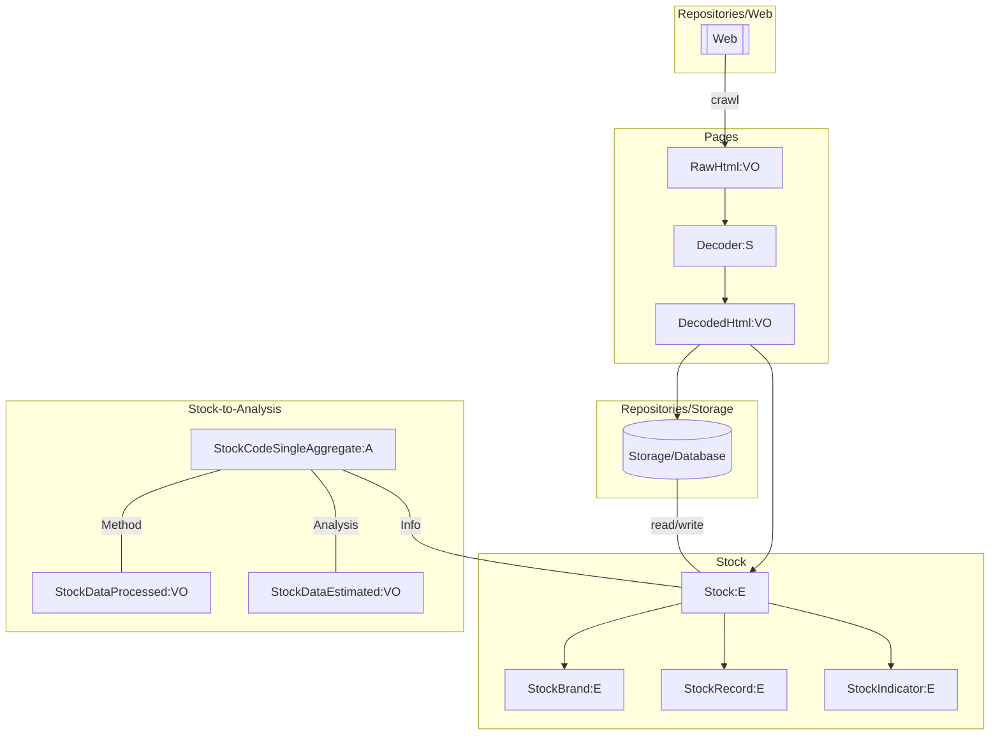
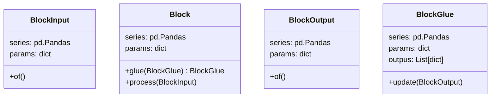
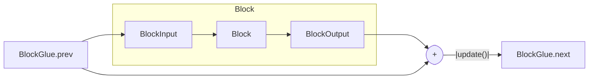

# kabutobashi

[](https://github.com/gsy0911/kabutobashi/actions?query=workflow%3Apytest)
[](https://codecov.io/gh/gsy0911/kabutobashi)
[](https://github.com/psf/black)
[](https://pycqa.github.io/isort/)
[](http://mypy-lang.org/)

[](https://pypi.org/project/kabutobashi/)
[](https://pypi.org/project/kabutobashi/)
[](https://kabutobashi.readthedocs.io/en/latest/?badge=latest)

## concept

class-relationship.

- `E`: Entity
- `VO`: ValueObject
- `S`: Service
- `A`: Aggregate




## usage

```python
import kabutobashi as kb

df = kb.example()
methods = kb.methods + [kb.basic, kb.pct_change, kb.volatility]
analysis = kb.stock_analysis
agg = kb.StockCodeSingleAggregate.of(entity=df, code="1234").with_processed(methods).with_estimated(stock_analysis=analysis)
print(agg)

# n日前までの営業日の日付リストを取得する関数
target_date = "2020-01-01"
date_list = kb.get_past_n_days(target_date, n=40)

```

## concept: Blocks

### Block

Abstract classes are `BlockInput`, `Block`, and `BlockOutput`.
`BlockGlue` is concrete class to connect two-Blocks.



Relationships and data-flow between classes.



### Read-Block

- input
  - params
- output
  - series

### Crawl-Block

- input
  - params
- output
  - output.params

### PreProcess-Block

- input
  - series
  - params
- output
  - series

### Process-Block

- input
  - series
  - params
- output
  - output.series

### Parameterize-Block

- input
  - series
  - params
- output
  - output.params

### Reduce-Block

- input
  - series
  - params
- output
  - params
